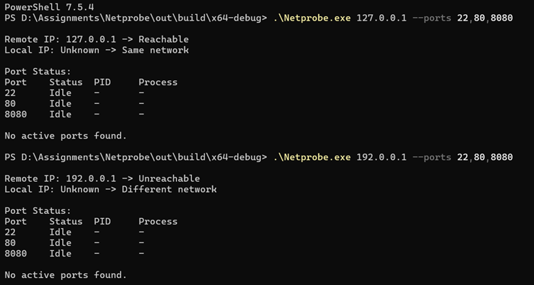
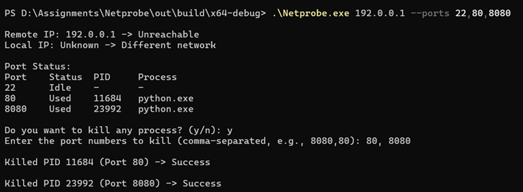
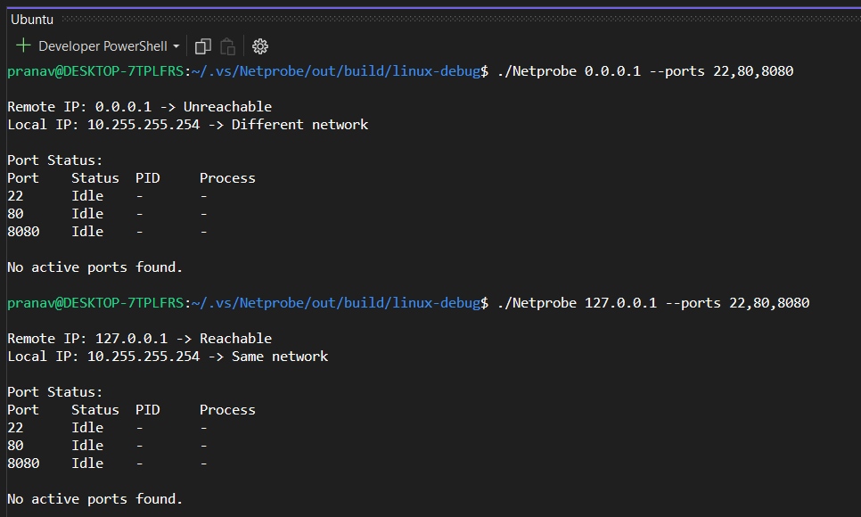

## Overview
A small cross-platform C++ tool to:
- Check remote IP reachability (via ping)
- Detect if local and remote IPs are in the same network
- Scan local ports and show status (Used/Idle)
- Optionally kill processes holding a port

## Features
- Cross-platform (Windows + Linux/WSL)
- Uses CMake for easy build
- Optional `--kill` flag to terminate port processes

---

## 🖥️ Windows Execution

## 🐧 Linux Execution

